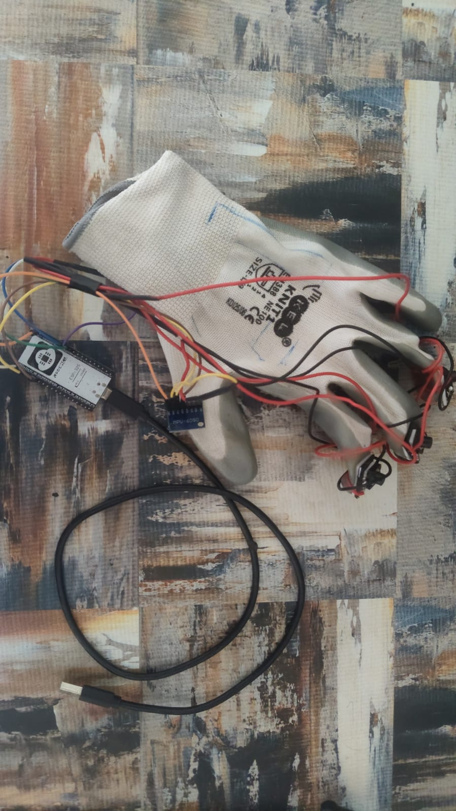
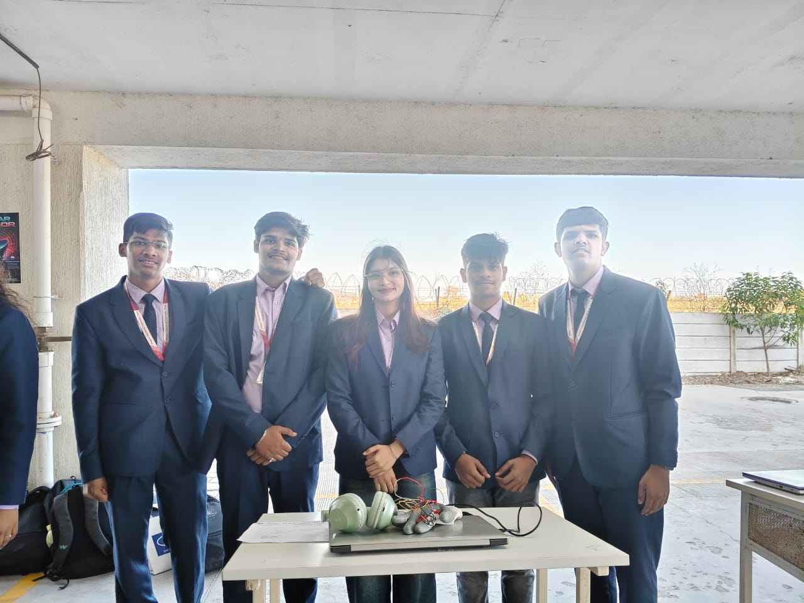
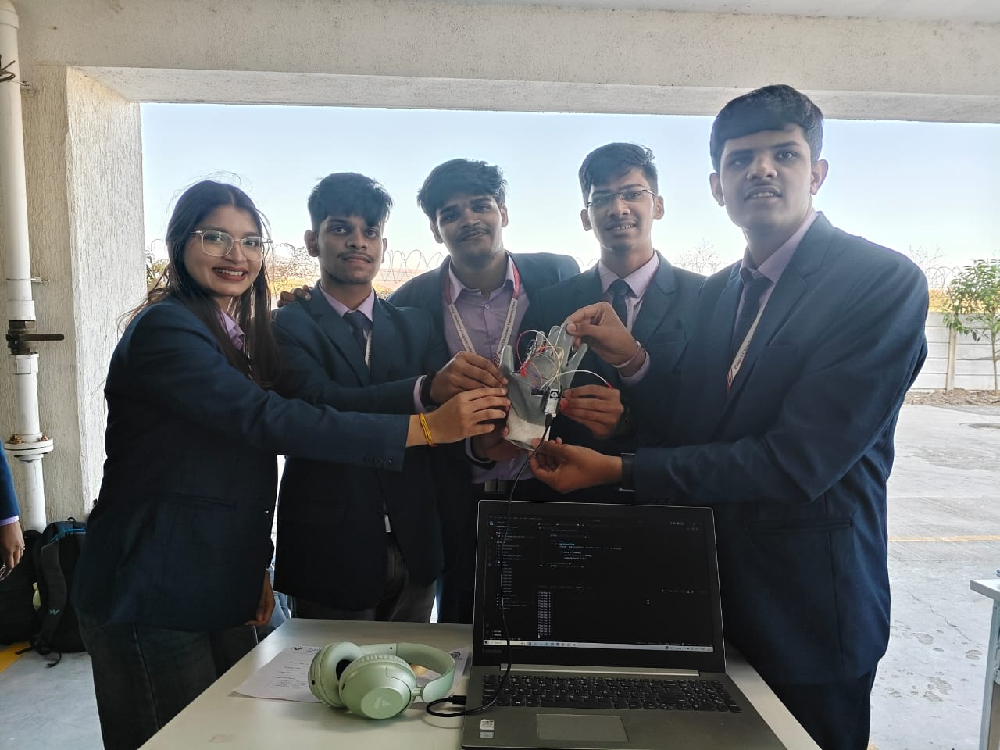
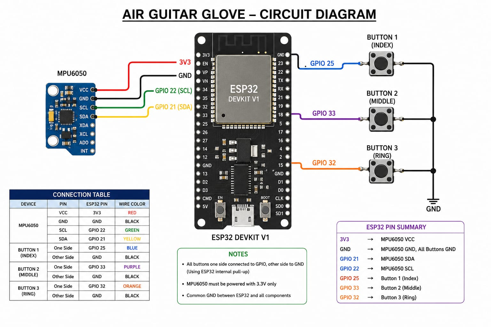
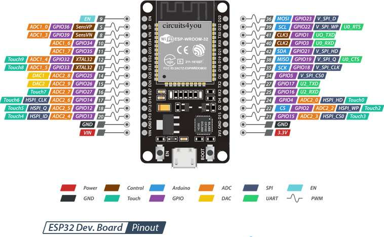
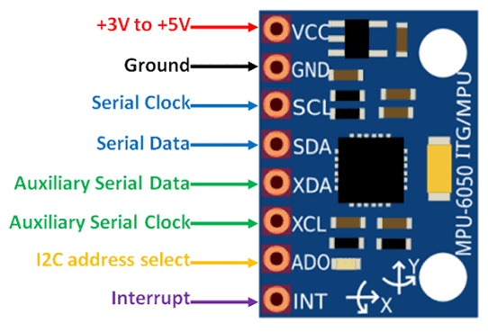
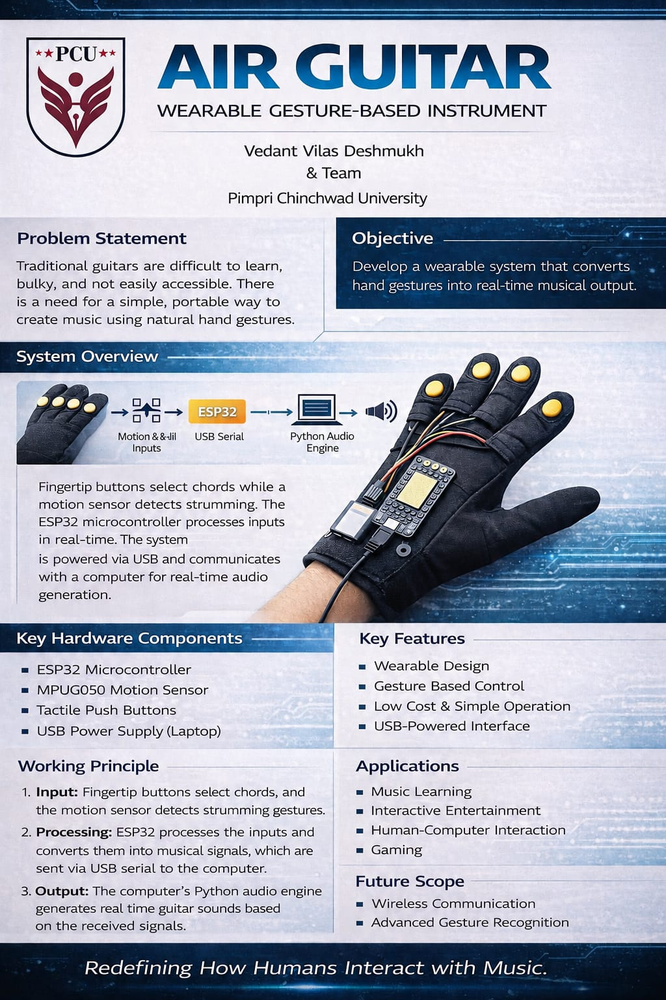

# 🎸 Air Guitar — ESP32 Wireless Wearable

> **🏆 Runner Up — Techneon 2K26 | Pimpri Chinchwad University**

A wearable gesture-controlled Air Guitar built using ESP32, MPU6050, and Python.  
Play guitar without strings, select chords using buttons on a glove, swing your hand to strum, and hear real-time sound playback wirelessly on your PC.

---

## 📸 Project Gallery

<p align="center">
  
  
  
</p>

<p align="center">
  
  
</p>

---

## 🚀 Features

- 🎛 ESP32-based embedded system
- 📡 Bluetooth wireless communication
- 🎵 Real-time guitar chord playback using Python
- 🎹 Button-based chord selection (8 chords)
- 🤚 Swing-to-strum gesture detection via MPU6050
- 🔌 USB powered via laptop
- 🧤 Wearable glove-mounted prototype
- 🔧 Modular and expandable architecture

---

## 🧠 How It Works

1. Push buttons on the glove select the desired chord
2. Swing your hand — MPU6050 detects the strum gesture
3. ESP32 reads inputs and transmits via Bluetooth
4. Python app on PC receives the signal
5. Corresponding WAV file plays instantly 🎸

```
Glove Buttons + MPU6050 → ESP32 → Bluetooth → Python App → Audio Output
```

---

## 🛠 Hardware Components

| Component | Details |
|-----------|---------|
| ESP32 DevKit V1 | ESP32-WROOM-32 |
| MPU6050 | GY-521 (Gyroscope + Accelerometer) |
| Push Buttons | 3 × Tactile buttons |
| Base | Wearable glove |
| Power | USB (via Laptop) |

---

## 🔌 Circuit & Pinouts

<p align="center">
  
  
</p>

<p align="center">
  
</p>

---

## 📄 Project Poster

<p align="center">
  
</p>

---

## 💻 Software Requirements

**Embedded Side**
- Arduino IDE
- ESP32 Board Support Package

**Python Side**
- Python 3.12.10
- pyserial
- pygame

```bash
pip install pyserial pygame
```

---

## 📂 Project Structure

```
Air-Guitar-ESP32/
│
├── firmware/
│   └── air_guitar.ino            # ESP32 Arduino code
│
├── src/
│   ├── air_guitar_With_UI.py     # Python app with UI
│   ├── air_guitar.py             # Core Python app
│   └── bluetoothpython.py        # Guitar with Bluetooth communication
│
├── sounds/                       # WAV chord files
│   ├── a_major.wav
│   ├── a_minor.wav
│   ├── c_major.wav
│   ├── d_major.wav
│   ├── e_major.wav
│   ├── e_minor.wav
│   ├── f_major.wav
│   └── g_major.wav
│
├── images/                       # Project photos & diagrams
│   ├── actual_model.jpeg
│   ├── awardwinning.jpeg
│   ├── circuit.jpeg
│   ├── ESP32-Pinout.jpeg
│   ├── mpu-pinout.jpeg
│   ├── grpphoto.jpeg
│   ├── grpphoto1.jpeg
│   └── interaction_with_vc.jpeg
│
├── docs/                         # Report & documentation
│   └── project_poster.jpeg
└── README.md
```

---

## ⚙️ How To Run

**1️⃣ Upload ESP32 Code**
- Open Arduino IDE
- Select ESP32 Dev Module
- Upload `firmware/air_guitar.ino`

**2️⃣ Pair ESP32 via Bluetooth**
- Pair ESP32 with your laptop
- Note the COM port assigned

**3️⃣ Run Python App**
```bash
cd src
python air_guitar_With_UI.py
```
Press buttons + swing hand → hear chord sound 🎸

---

## 🎼 Chord Mapping

| Button Combination | Chord |
|-------------------|-------|
| 000 | C Major |
| 001 | G Major |
| 010 | A Minor |
| 011 | F Major |
| 100 | D Major |
| 101 | E Minor |
| 110 | A Major |
| 111 | E Major |

---

## 🔋 Power Flow (Future Upgrade)

```
18650 Battery → TP4056 Charging Module → MT3608 Boost Converter (5V) → ESP32
```

---

## 🔮 Future Improvements

- [ ] Advanced gesture recognition using MPU6050 ML model
- [ ] Mobile app integration
- [ ] MIDI output support
- [ ] Custom PCB wearable design
- [ ] More chord variations
- [ ] Built-in Audio support
- [ ] Independent Power Source

---

## 👨‍💻 Developed By

**Vedant Vilas Deshmukh**  
First Year B.Tech — School of Engineering & Technology  
Pimpri Chinchwad University, Pune  
🏆 Runner Up — Techneon 2K26

---

## ⭐ Support

If you like this project, give it a ⭐ and feel free to fork or contribute!
